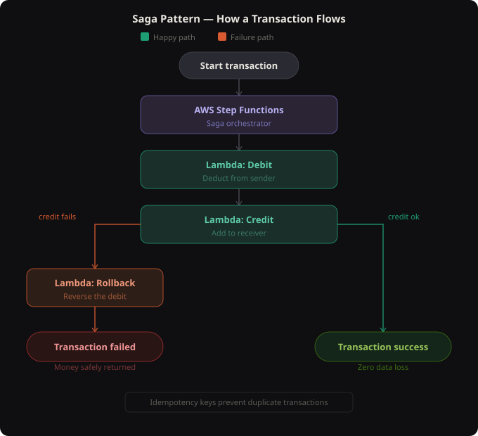

# 🏦 High-Availability Banking Transaction System  
### Zero Data Loss • Exactly-Once Execution • Serverless AWS

---

## 🚀 Introduction
This project implements a **serverless banking transaction system** on AWS that guarantees:

✅ Exactly-once execution  
✅ Strong consistency  
✅ Automatic rollback on failure  
✅ Zero data loss  

It solves a **real-world distributed systems problem** where partial failures during money transfers can lead to inconsistencies.

The solution is built using the **Saga Pattern**, widely used in financial and payment systems.

---

## ❓ Problem Statement
In distributed banking systems, a transaction may fail partially:

- 💸 Debit succeeds  
- ❌ Credit fails  
- ⚠️ System becomes inconsistent  

This project ensures that:
- ✔️ Either the transaction completes fully, or  
- 🔄 The system safely rolls back to its original state  

No partial updates. No money loss.

---

## 🏗️ Architecture Overview
The system follows a **serverless, event-driven architecture**:

- 🧠 **AWS Step Functions** – Transaction orchestrator  
- ⚙️ **AWS Lambda** – Debit, Credit, Rollback logic  
- 🗄️ **Amazon RDS (PostgreSQL)** – Strongly consistent data store  
- 🔐 **AWS IAM** – Secure access control  
- 📊 **CloudWatch** – Logs and observability  

---

## 🔁 Transaction Workflow (Saga Pattern)

- Transaction Request
- ↓
- Step Functions
- ↓
- Debit Lambda
- ↓
- Credit Lambda
- ↓
- ✅ Success
- If Credit Fails
- ↓
- Rollback Lambda
- ↓
- ❌ Safe Failure (No Data Loss)

---

## 🧩 Lambda Functions

### 💳 Debit Lambda
- Checks account balance
- Performs atomic debit
- Enforces idempotency
- Records transaction state

---

### 💰 Credit Lambda
- Credits destination account
- Updates transaction status

---

### 🔄 Rollback Lambda
- Executes compensating transaction
- Restores debited amount
- Marks transaction as rolled back

Each Lambda is **stateless** and focused on a **single responsibility**.

---

## 🧠 Step Functions Orchestration
AWS Step Functions act as the **control plane** of the system:

✨ Defines execution order  
✨ Handles retries with backoff  
✨ Routes failures to rollback  
✨ Provides visual execution tracking  

Used features:
- Task states
- Retry policies
- Catch blocks
- Success & Fail states

---

## 🔑 Exactly-Once Processing
To prevent duplicate transactions:

- Each request includes an **idempotency key**
- Debit Lambda checks for existing transactions
- Duplicate requests return safely without reprocessing

This ensures **no double debit or credit**.

---

## ❌ Failure Handling
The system is designed to be **failure-resilient**:

- Any downstream failure triggers rollback
- Partial executions are automatically compensated
- Database transactions ensure consistency

💡 Result: **Zero financial data loss**

---

## 👀 Observability
- 📜 Lambda logs captured in CloudWatch
- 🧭 Step Functions show execution flow visually
- 🔍 Errors and retries are traceable end-to-end

---

## ⚙️ Environment Configuration
Each Lambda is configured using environment variables:

- DB_HOST
- DB_NAME
- DB_USER
- DB_PASSWORD
- DB_PORT

🗂️ Database Schema (Simplifie)

- 🧾 Accounts Table
- account_id
- balance

📄 Transactions Table

- txn_id
- from_account
- to_account
- amount
- status
- idempotency_key

🚀 Deployment Summary

- 1️⃣ Create PostgreSQL RDS instance,
- 2️⃣ Configure IAM roles,
- 3️⃣ Deploy Debit, Credit, Rollback Lambdas
- 4️⃣ Package dependencies for Linux runtime
- 5️⃣ Create Step Functions state machine
- 6️⃣ Validate success & failure scenarios
- 7️⃣ Clean up cost-incurring resources

🔐 Security Considerations

- Least-privilege IAM roles
- Stateless Lambda design
- Controlled retries and timeouts
- Secure database connectivity

📌 Project Status

- ✅ Core system implemented
- ✅ Success and failure flows validated
- ✅ Production-aligned architecture
- ✅ Ready for extension and hardening
- 🔮 Future Enhancements
- 🌐 API Gateway for external access
- 🔑 Authentication using JWT / Cognito
- 🔒 AWS Secrets Manager for credentials
- 📈 CloudWatch metrics and alarms
- 💸 Performance and cost optimization

